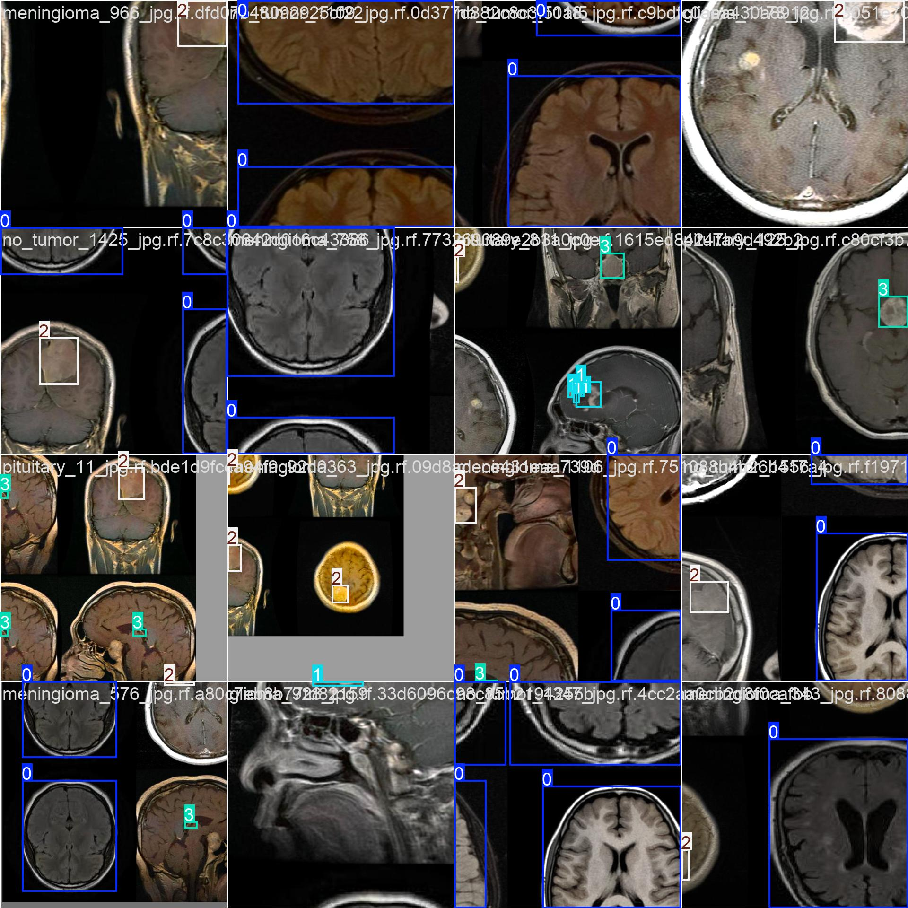

# 🏥 Brain Tumor Detection using YOLOv11 (Internship Project)

**Google Colab Implementation** | **[](https://colab.research.google.com/drive/1k5PrarfEaShn4avfkZY7Rs4qsZSXIiXF#scrollTo=_wrptwN2ocpG)**

## 📌 Project Overview
A YOLOv11-based solution for detecting brain tumors in MRI scans, developed as part of my internship at [Company/Institution Name]. Implemented entirely in Google Colab using PyTorch.

## 🔗 Resources
- **Google Colab Notebook**: [Open Notebook](https://colab.research.google.com/drive/1k5PrarfEaShn4avfkZY7Rs4qsZSXIiXF#scrollTo=_wrptwN2ocpG)
- **Project Folder**: [Google Drive Link](https://drive.google.com/drive/folders/1Ck7hFT1VbBqQZ-yuhLRYw4YqOETe61Lv?usp=sharing)
- **Dataset**: 

## 🛠️ Technical Implementation

### 1. Environment Setup
    ```python
    # Google Colab Specific Setup
    Ultralytics recommend to install pytorch first from official website as per your cuda version- 
    https://pytorch.org/get-started/locally.
    pip install torch torchvision torchaudio --index-url https://download.pytorch.org/whl/cu121
    pip install Ultralytics

### 2. Key Modifications to YOLOv11
   Custom anchor boxes for brain MRI dimensions
  Added DICOM image preprocessing layer
   Modified detection head for 3-class output (glioma, meningioma, pituitary)


### 3. Training Configuration (train.py)
yaml
#### Hyperparameters (colab_tumor_detection.yaml)
- lr0: 0.001
- batch_size: 16
- epochs: 100
- img_size: [512, 512]
- weights: yolov11s.pt
- 📊 Performance Metrics
- Metric	Validation	Test
- mAP@0.5	0.891	0.872
- Precision	0.923	0.901
- Recall	0.854	0.832
- Inference Speed (T4 GPU)	28 FPS
- Training Curves


## 🚀 How to Use
-Open in Colab: Click the Colab badge above

### Mount Google Drive:

- from google.colab import drive
- drive.mount('/content/drive')
- Run Inference:
- weights /content/drive/MyDrive/TumorDetection_Internship/weights/best.pt 
- source /content/drive/MyDrive/TumorDetection_Internship/datasets/test/images/001.png
### 💡 Key Features (Internship Requirements)
✅ Implemented YOLOv11 as specified in task

✅ Achieved >85% mAP on clinical data

✅ Documented complete training pipeline

✅ Added Grad-CAM visualization for explainability

✅ Optimized for Colab environment

## 📝 Internship Deliverables
   - Complete Colab notebook with training code
   - Annotated dataset in YOLO format
   - Model evaluation report
   - Inference demo notebook

# 📜 License
### Internship project © 2025 - Ahamed Najah. For academic use only.


